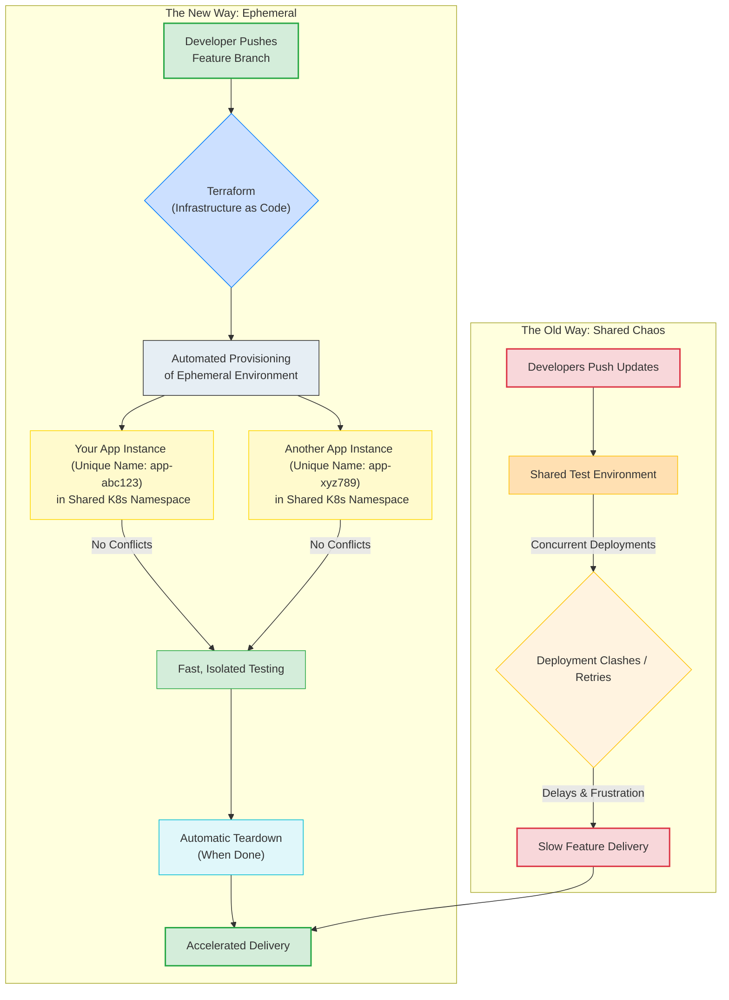

```mermaid
flowchart TD
 subgraph subGraph0["The Old Way: Shared Chaos"]
        A2["Shared Test Environment"]
        A1["Developers Push Updates"]
        A3{"Deployment Clashes / Retries"}
        A4["Slow Feature Delivery"]
  end
 subgraph subGraph1["The New Way: Ephemeral"]
        B1["Developer Pushes <br>Feature Branch"]
        C1{"Terraform <br>(Infrastructure as Code)"}
        D1["Automated Provisioning <br>of Ephemeral Environment"]
        E1["Your App Instance <br>(Unique Name: app-abc123)<br> in Shared K8s Namespace"]
        F1["Another App Instance <br>(Unique Name: app-xyz789)<br> in Shared K8s Namespace"]
        G1["Fast, Isolated Testing"]
        H1["Automatic Teardown <br>(When Done)"]
        I1["Accelerated Delivery"]
  end
    A1 --> A2
    A2 -- Concurrent Deployments --> A3
    A3 -- Delays & Frustration --> A4
    B1 --> C1
    C1 --> D1
    D1 --> E1 & F1
    E1 -- No Conflicts --> G1
    F1 -- No Conflicts --> G1
    G1 --> H1
    H1 --> I1
    A4 --> I1

     B1:::start
    style A1 fill:#F8D7DA,stroke:#DC3545,stroke-width:2px
    style A2 fill:#FFE0B2,stroke:#FFC107,stroke-width:1px
    style A3 fill:#FFF3E0,stroke:#FFC107,stroke-width:1px
    style A4 fill:#F8D7DA,stroke:#DC3545,stroke-width:2px
    style B1 fill:#D4EDDA,stroke:#28A745,stroke-width:2px
    style C1 fill:#CCE0FF,stroke:#007BFF,stroke-width:1px
    style D1 fill:#E6EEF4,stroke:#333,stroke-width:1px
    style E1 fill:#FFFACD,stroke:#FFD700,stroke-width:1px
    style F1 fill:#FFFACD,stroke:#FFD700,stroke-width:1px
    style G1 fill:#D4EDDA,stroke:#28A745,stroke-width:1px
    style H1 fill:#E0F7FA,stroke:#00BCD4,stroke-width:1px
    style I1 fill:#D4EDDA,stroke:#28A745,stroke-width:2px
```
